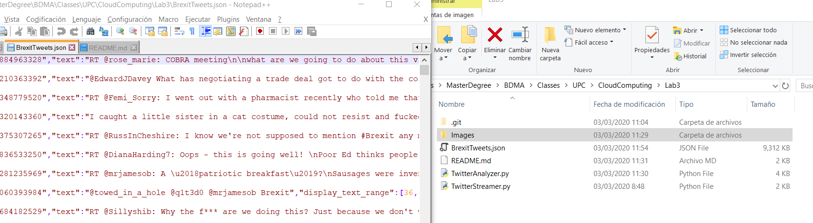
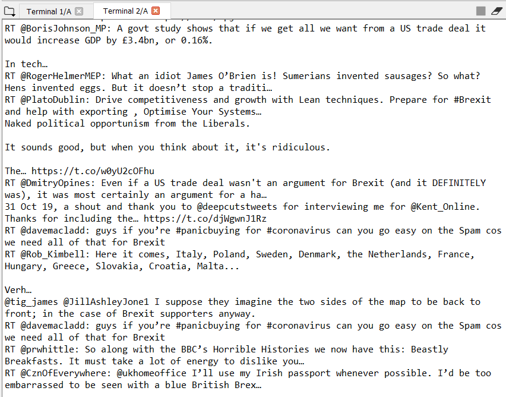
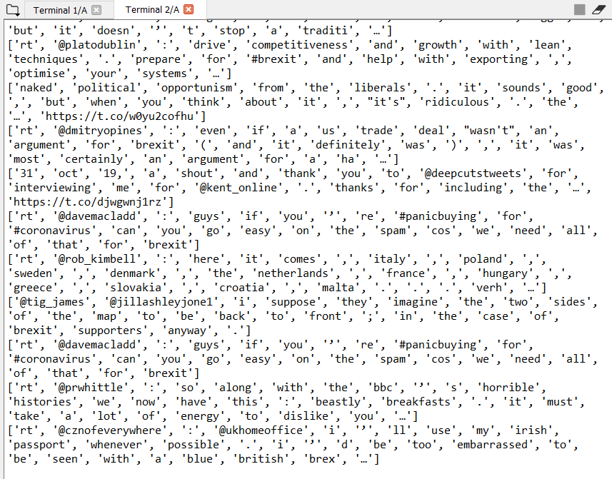
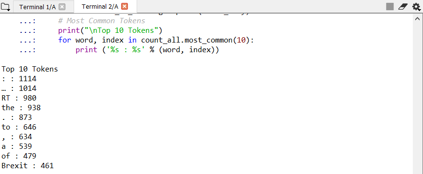
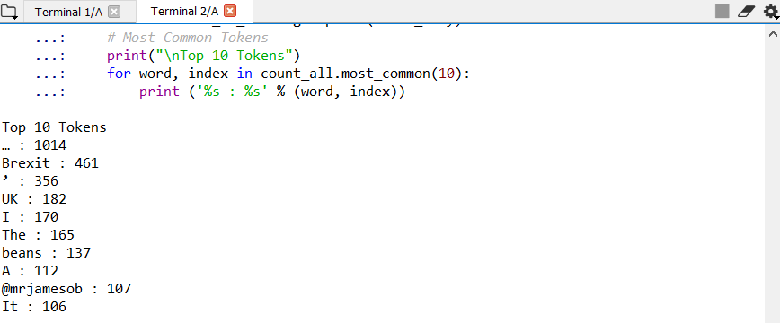
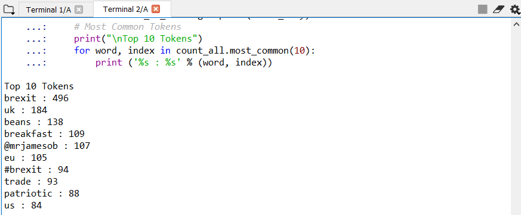
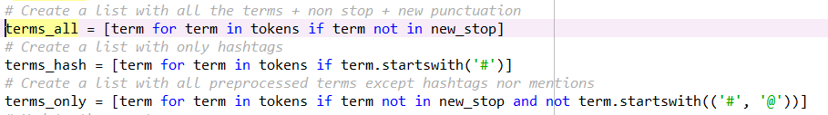
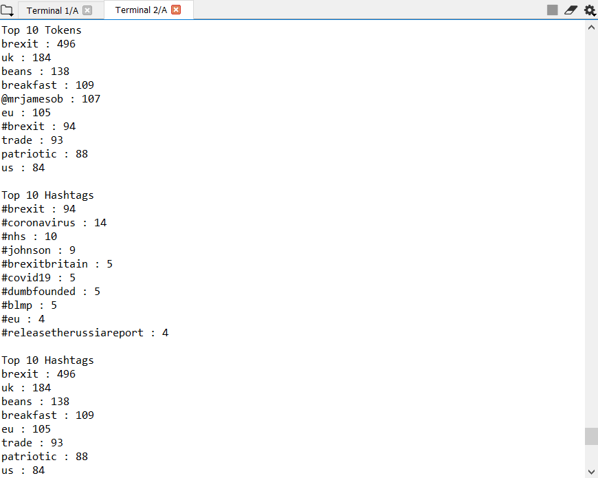

# "CLOUD-COMPUTING-CLASS-2020" 
# Lab3
## Group Members:
-Jesus Huete (jesus.santiago.huete@est.fib.upc.edu)  
-Julio Candela (julio.christians.candela@est.fib.upc.edu)

# Experimentation  

## Task 3.1  
### Streaming of the word "Brexit" on Twitter 
- It's a word massively used in the last months, so it's interesting for further analysis. We got a lot of tweets in a few minutes.

## Task 3.2
### 1. Print the tweets from the streaming json file in real time

### 2. Tokenize each tweet in order to extract the words

### 3. Get the result of the common words without preprocessing
- Due to the high amount of punctuations, we require to apply preprocessing to drop the punctuations.

### 4. Drop some stop words 
- Frequent words according to the dictionary and punctuations according to the library string

### 5. Drop some new stop words and normalize the words as lowercase
- Some punctuations weren't taken into account ("’","…","‘"). Moreover,we have used the lowercase option of preprocess function to normalize words in order to have better insights since some stop words in uppercase were generating noise ("A", "I")

### 6. Itemsets for all words, only hashtags, and words except hashtags or mentions

### 7. Results: TOP 10 words, TOP 10 hashtags, TOP 10 tokens without mentions nor hashtags
- Interesting to see that the most common word "brexit" appears consistent between the three different scenarios, but the following ones change depending whether it's a hashtag or so. What's surprising is that there are other words not related to Brexit, like 'breakfast' and 'beans', which also appear as the most used words.
- Other two words that have a good correlation to Brexit appear to be 'patriotic' and 'trade'. Probably two subjects that are heavily mentioned when referencing to Brexit.

## Task 3.3
### 1. Bar Chart of frequent words after pre processing (without hashtags or mentions):

### 2. Bar Chart of frequent hashtags:
