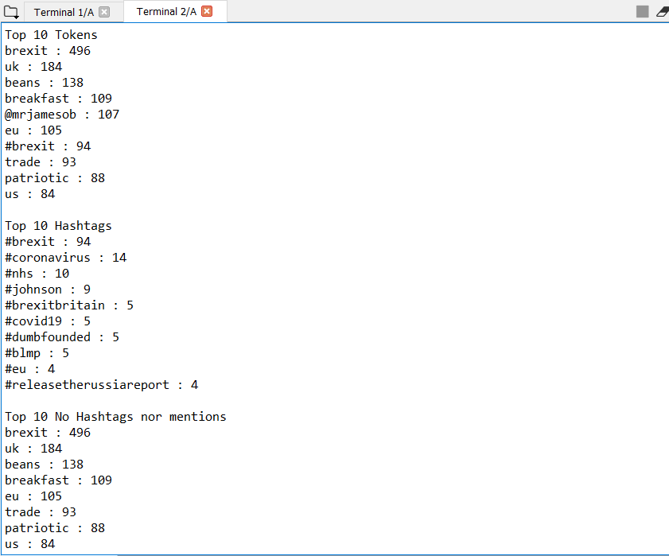

# "CLOUD-COMPUTING-CLASS-2020" 
# Lab3
## Group Members:
-Jesus Huete (jesus.santiago.huete@est.fib.upc.edu)  
-Julio Candela (julio.christians.candela@est.fib.upc.edu)

# Experimentation  

## Task 3.1  
### Streaming of the word "Brexit" on Twitter 
- It's a word massively used in the last months, so it's interesting for further analysis. We got a lot of tweets in a few minutes.

## Task 3.2
### 1. Print the tweets from the streaming json file in real time

### 2. Tokenize each tweet in order to extract the words

### 3. Get the result of the common words without preprocessing
- Due to the high amount of punctuations, we require to apply preprocessing to drop the punctuations.

### 4. Drop some stop words 
- Frequent words according to the dictionary and punctuations according to the library string

### 5. Drop some new stop words and normalize the words as lowercase
- Some punctuations weren't taken into account ("’","…","‘"). Moreover,we have used the lowercase option of preprocess function to normalize words in order to have better insights since some stop words in uppercase were generating noise ("A", "I")

### 6. Itemsets for all words, only hashtags, and words except hashtags or mentions

### 7. Results: TOP 10 words, TOP 10 hashtags, TOP 10 tokens without mentions nor hashtags
- Interesting to see that the most common word "brexit" appears consistent between the three different scenarios, but the following ones change depending whether it's a hashtag or so. What's surprising is that there are other words not related to Brexit, like 'breakfast' and 'beans', which also appear as the most used words.
- Other two words that have a good correlation to Brexit appear to be 'patriotic' and 'trade'. Probably two subjects that are heavily mentioned when referencing to Brexit.

## Task 3.3
### 1. Bar Chart of frequent words after pre processing (without hashtags or mentions):

- Similar to the analysis previously done, we see that the most common word mentioned is 'Brexit', both for text (without hashtags and mentions) and hashtags. Moreover, there are words as breakfast, sausage, baked which according to our research are part of how citizens ironically use when talking about the "Brexit"

### 2. Bar Chart of frequent hashtags:

- There are 2 hashtags which call attention: "#johnson" and "#dumbfounded". "Johnson" probably referring to the prime minister. Could it be that "#dumbfounded" is also referring to him?

## Task 3.4 " Turkey"
For the proposal, we found an interesting topic about an immigration incident happening in Turkey.
### 1. Bar Chart of frequent words after pre processing (without hashtags or mentions):
Due to a recent immigration policy set by Turkey were they opened the borders for immigrants to croos to Europe through Greace, there's a big conflict going on in between both countries. That most probably is the reason for the words we see within the graphs.
"Assad" can be related to the Sirian president, due to the attack that Turkey launched against Siria few days ago. So as expected, all of the words related to Turkey are related to these recent news of the countries involvement.

### 2. Bar Chart of frequent hashtags:
The hashtags have the same relation to the news previously explained. They mention Turkey's president "#erdogan", a town in Siria "Idlib" and even the involvement with "#russia". You can even note support for Greece from some tweets with the hashtags "#istandwithgreece" and "#greecedefendseurope".

#### Q35:
We've been working on this session for around 5 complete hours.
Issues that arose while working were related mostly to the data pre-processing for extracting the tokens from the tweets. Some of the topics selected for search before were "Netflix" and "Mexico". They gave good insights of the movies or series trending in Netflix, like "Beauty and the Beast", or strong topics in Mexico like the coronavirus case.
Due to that data extracted, we had to implement filtering on stopwords for more languages, like Spanish and even Chinese symbols. Furthermore, we found some special characters that were not readable and we were unable to identify. 
Thus decided to change topic and search for something trending globally, like the Turkey immigration and attacks news.